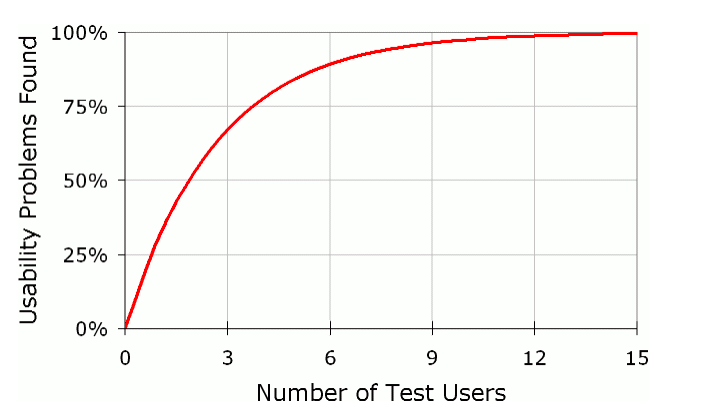

# Who, when, why of feedback

## Why get feedback: You are not the target user.

In virtually all cases, you are not the target user for your tool. Your target user will have a different skillset, different goals, etc. This means that what seems obvious for you may be difficult for your users. Alternatively, something that you worry will be complicated will actually be quite easy for them.

## Who should you run it by?

Ideally you would run it by a user or potential user of your tool. You can get in contact with users by leveraging either a mailing list or poster session to get contact information for a potential user. You can get in contact with potential users by leveraging other groups at the Genomics Institute to see if they have access to users who might want to use your tool.

If you don't have access to users or potential users, you next best option is a coworker, ideally one who has as close to the same skillet that you are trying to target. 

Typically, PIs, managers, etc are not the most helpful people to get feedback from when considering your design from the perspective of your users. They will have lots of interesting ideas, but since they are not your target user, they will just be guessing, same as you, as to what your users really want. 

## How many people should you run it by?

Industry rules is 3-5, but in practice, even one person will **significantly** help you. Research shows that 1 person can help you find up to 1/3 of the usability bugs with a tool.



## When should you get feedback

Ideally early and often. Interestingly, you can often get the best feedback from users when your designs are the roughest \(paper and pencil, slides, etc\), because users feel more free to give frank feedback because they know you haven't invested so much time in it that you can't pivot to something else.

